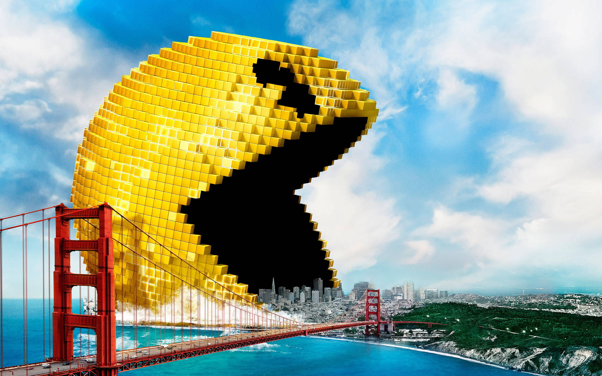

# 📸 Pexels Clone

Questo progetto è un **clone di Pexels** che permette di cercare e visualizzare foto e video utilizzando l'**API di Pexels**.  
L'interfaccia è stata sviluppata con **HTML5**, **JavaScript** e **CSS**, ed è completamente **responsive** per tutti i dispositivi.

    

---

## 📌 Funzionalità Principali
- 🔍 **Ricerca contenuti**: Gli utenti possono cercare foto e video di alta qualità.
- 🖼️ **Visualizzazione contenuti**: Layout a griglia con effetti hover moderni.
- 📥 **Download**: Possibilità di scaricare i contenuti in diverse qualità.
- 💫 **Modal interattivo**: Visualizzazione dettagliata con contenuti correlati.
- 🎥 **Supporto video**: Integrazione completa di foto e video nella ricerca.
- 📱 **Design responsive**: Layout ottimizzato per mobile, tablet e desktop.

---

## 🚀 Tecnologie Utilizzate
- **HTML5** - Struttura semantica della pagina.
- **CSS3** - Stile moderno e animazioni fluide.
- **JavaScript (ES6+)** - Logica di interazione e gestione API.
- **Fetch API** - Per le chiamate all'API di Pexels.
- **Pexels API** - Fonte dei contenuti multimediali.
- **Font Awesome** - Set di icone moderne.

---

## 📌 Struttura del Progetto
📂 **index.html** - Struttura principale della pagina  
📂 **styles.css** - Stili generali e responsive  
📂 **modal.css** - Stili specifici per il modal  
📂 **script.js** - Logica JavaScript e integrazione API  

---

## ⚙️ Funzionalità Dettagliate
- **Ricerca avanzata**: Filtro per tipo di contenuto (foto/video)
- **Modal interattivo**: Preview dettagliata con info fotografo
- **Contenuti correlati**: Suggerimenti basati sulla visualizzazione corrente
- **Download multipli**: Opzioni di qualità per ogni contenuto
- **Infinite scroll**: Caricamento dinamico dei contenuti
- **Condivisione social**: Integrazione con i principali social network

---

## 🎯 Obiettivi del Progetto
👉 Implementare un'interfaccia **moderna e responsive**  
👉 Ottimizzare le **chiamate API** e la gestione dei dati  
👉 Creare un'esperienza utente **fluida e intuitiva**  
👉 Fornire funzionalità di **ricerca e filtro avanzate**  

---

## 🤝 Contributi
Contributi e suggerimenti sono benvenuti! Apri una **issue** per proporre miglioramenti.

---

## 📝 Licenza
Questo progetto è distribuito con licenza MIT. Vedere il file `LICENSE` per maggiori informazioni.
